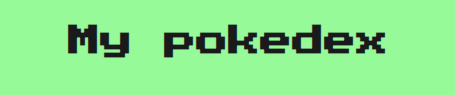

## Sobre
Essa é a simulação de uma pokedex feita em VueJs e consumindo a API PokeApi via Javascript.
Nela, eu mostro todos os Pokémon da primeira até a oitava geração.
<br/>

<div style="display: inline_block"><br>
    
</div>

## Demonstração
<b>Clique <a href="https://secure-stream-32025.herokuapp.com/">aqui</a> para acessar o site</b>
<br/><br/>


## Project setup
```
npm install
```

### Compiles and hot-reloads for development
```
npm run serve
```

### Compiles and minifies for production
```
npm run build
```

### Lints and fixes files
```
npm run lint
```
<br/>
Baixe o <a href="https://git-scm.com/">GIT</a>, <a href="https://nodejs.org/en/">NodeJS</a> e <a href="https://cli.vuejs.org/">Vue CLI</a> na sua máquina.
<br/><br/>
<b>Autor:</b> <a href="beacons.ai/danvinicius">Daniel Vinícius</a>
